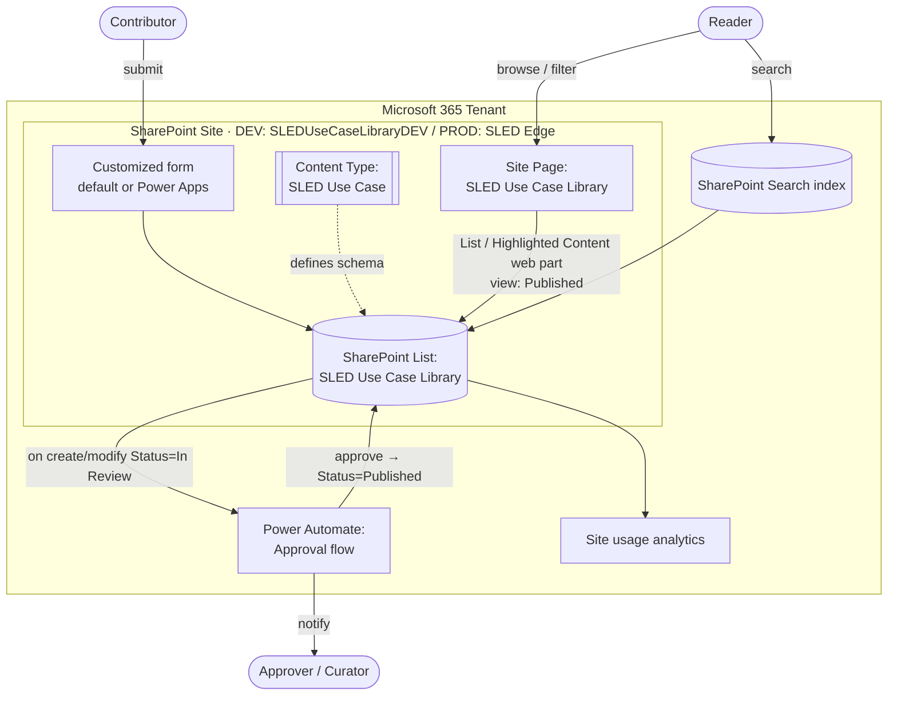
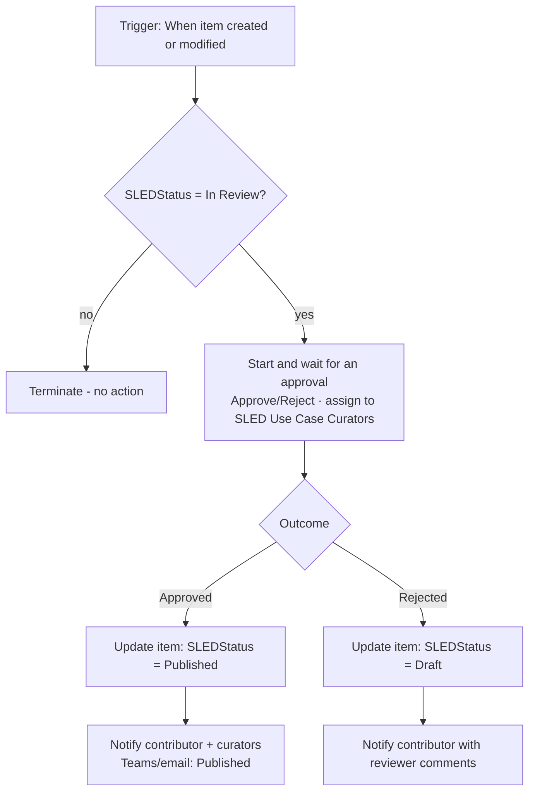

# SLED Use Case Library — Phase 1: Plan & Architecture

**Audience:** Microsoft internal — SLED GTM team, SLED Edge site owners, SLED field/solution specialists, library curators
**Domain:** State & Local Government, Education (SLED) industry use cases for internal reuse and GTM enablement
**Document type:** Architecture & implementation plan (design only — no code in this phase)
**Status:** Draft v1.0 — **Phase 1 deliverable for review/approval**
**Last updated:** 2026-06-29

> **Phase gate.** This document is the Phase 1 output. It defines the architecture, data model, governance, UX, and deployment approach for the SLED Use Case Library. **No code or provisioning is performed in this phase.** Implementation (Phase 2 prototype) begins only after you approve this plan.
>
> **Relationship to the Hackathon Content Library (HCL).** The HCL (in [`hackathon-content-library/`](../hackathon-content-library/)) is a separate, completed solution that remains **as-is**. It is referenced here only as a proven pattern for SharePoint Online + Microsoft Lists delivery. All new SLED content lives under this `SLEDEdge/` folder and is fully independent.

---

## Table of Contents

1. [Executive Summary](#1-executive-summary)
2. [Goals, Scope & Non-Goals](#2-goals-scope--non-goals)
3. [Personas & Users](#3-personas--users)
4. [Solution Architecture](#4-solution-architecture)
5. [Environment Strategy & Naming Conventions](#5-environment-strategy--naming-conventions)
6. [Canonical Data Model (List Schema)](#6-canonical-data-model-list-schema)
7. [Choice Field Value Sets](#7-choice-field-value-sets)
8. [Information Architecture, Views & Indexing](#8-information-architecture-views--indexing)
9. [Site Page & UX Design](#9-site-page--ux-design)
10. [Contribution & Approval Workflow](#10-contribution--approval-workflow)
11. [Permission & Governance Model](#11-permission--governance-model)
12. [SLED Edge Integration Plan](#12-sled-edge-integration-plan)
13. [Tracking & Analytics](#13-tracking--analytics)
14. [Deployment Strategy (DEV → PROD)](#14-deployment-strategy-dev--prod)
15. [Phase Plan & Deliverables](#15-phase-plan--deliverables)
16. [Risks, Assumptions & Open Questions](#16-risks-assumptions--open-questions)
17. [Approval Checklist](#17-approval-checklist)

---

## 1. Executive Summary

### What it is
The **SLED Use Case Library** is an internal Microsoft catalog of reusable use cases spanning the five SLED industry verticals: **State & Local Government, Public Safety & Justice, Public Health & Social Services, Transportation & Urban Infrastructure, and Education.** It lets Microsoft teams **contribute** use cases, **browse** by industry/segment/keyword, and **reuse** proven scenarios — surfaced through a modern SharePoint Online page inside the **SLED Edge** GTM hub.

### Why it matters
Today SLED use cases live in static pages (e.g., the existing Public Sector Scenarios table), decks, and scattered files. They are hard to contribute to, hard to filter, and quickly go stale. The Use Case Library replaces the static table with a **structured, governed, searchable, and collaborative** system of record:

- **Contribute** — a guided submission form with required fields, so every entry is complete.
- **Discover** — filter by Industry, Segment, Tags; full-text search through SLED Edge.
- **Trust** — an approval workflow ensures only curated, **Published** content is broadly visible.
- **Reuse** — each entry links its reference architecture, demos, and supporting assets in one place.

### Technical approach
Built entirely on **Microsoft 365 no-code/low-code**: a **SharePoint List** (data) + a **SharePoint Site Page** with out-of-the-box web parts (UI) + an optional **Power Apps** customized form (richer submission) + a **Power Automate** approval flow (governance). This mirrors the proven HCL delivery model and keeps the solution maintainable by the SLED GTM team without custom code or SPFx.

### Delivery path
**Phase 1 (this doc): Plan/Design → Phase 2: Prototype in DEV → Phase 3: Review checkpoint → Phase 4: Deploy to PROD (SLED Edge).** Each phase stops for sign-off so design risk is retired before build, and build is validated before production.

---

## 2. Goals, Scope & Non-Goals

### Primary goals
1. A single SharePoint list as the **system of record** for SLED use cases with a consistent, portable schema.
2. An **industry-centric** browsing experience (filter/group by vertical and segment) on a modern site page.
3. A **governed contribution** path: submit → review → approve → publish, with only Published items visible to all.
4. Clean, **environment-agnostic** configuration so the solution ports from DEV to the production SLED Edge site with identical internal field names.

### In scope
- SharePoint Online list schema, content type, views, and column/field formatting.
- One modern site page with out-of-the-box web parts (List / Highlighted Content), responsive by default.
- Optional Power Apps customized list form for guided submission.
- Power Automate approval flow (item created/modified → approval → status update → notify).
- Permission model (Contributors / Approvers / Readers) and versioning/auditing.
- DEV prototype, then production deployment into SLED Edge with navigation linking.

### Non-goals (Phase 1)
- No SPFx / custom-coded web parts (prefer configuration for maintainability).
- No migration of the existing HCL solution — HCL stays as-is.
- No automated adoption metrics beyond what SharePoint/Search natively provide (adoption counts are curator-maintained).
- Events data is **not** merged into the use case model — events remain separate; the page may *link to* or *summarize* events only.
- In DEV we do **not** have the real SLED Edge site, so we build a **standalone DEV site** that fully represents the final experience; PROD integration happens in Phase 4.

---

## 3. Personas & Users

| Persona | Goal | Interaction | Permission tier |
|---|---|---|---|
| **SLED field / solution specialist (Contributor)** | Capture a use case they delivered; find reusable scenarios | Submit via form; browse/filter | Contribute (add/edit own) |
| **SLED GTM curator / strategist (Approver)** | Ensure quality; publish approved content; keep library fresh | Review approvals; edit any; manage views | Edit / Full Control on list |
| **SLED field at large (Reader)** | Discover proven use cases by industry to reuse with customers | Browse, filter, search, open assets | Read (Published only) |
| **SLED Edge site owner** | Integrate the library into the hub cleanly | Add page + nav; align theme | Site owner (PROD) |
| **Leadership / sponsor** | See coverage across verticals; evidence of reuse | View page + usage analytics | Read |

---

## 4. Solution Architecture

### 4.1 Component overview



### 4.2 Runtime data flow
1. A contributor opens the **Submit** form (default list form or Power Apps form) and completes required fields. Status defaults to **In Review** (or **Draft**).
2. On item create/modify, **Power Automate** starts an approval and notifies the curator group (Teams/email).
3. On **Approve**, the flow sets **Status = Published**; on **Reject**, it sets **Status = Draft** (or **Rejected**) and notifies the contributor.
4. The **site page** shows only the **Published** view via a List (or Highlighted Content) web part, grouped/filtered by Industry.
5. **SharePoint Search** indexes list content so SLED Edge search surfaces use cases.

### 4.3 Technology decisions

| Layer | Choice | Rationale |
|---|---|---|
| Data store | SharePoint List + Content Type | Native, governable, portable via list template / PnP; no infra |
| UI | Modern Site Page + List/Highlighted Content web parts | OOTB, responsive, no SPFx; curator-maintainable |
| Submission | Default form first; Power Apps form if needed | Start simple; upgrade to guided form only if default is insufficient |
| Workflow | Power Automate approval | No-code governance; Teams/email approvals; environment-agnostic where possible |
| Search | SharePoint Search (+ optional managed metadata for Tags) | Zero-build discoverability; taxonomy improves relevance |
| Formatting | Column/View JSON formatting | Card-like display & link buttons without custom code |

---

## 5. Environment Strategy & Naming Conventions

### 5.1 Environments

| | DEV | PROD |
|---|---|---|
| Site | New standalone site **`SLEDUseCaseLibraryDEV`** (Communication site → Blank) | Existing **SLED Edge** hub (new page + list) |
| Purpose | Build, seed, test without affecting production | Live library integrated into the GTM hub |
| Power Automate | Flow bound to DEV list | Flow re-pointed/re-created against PROD list |

### 5.2 Naming conventions (kept identical DEV ↔ PROD for portability)

| Object | Display name | Internal name |
|---|---|---|
| List | SLED Use Case Library | `SLEDUseCaseLibrary` |
| Content type | SLED Use Case | `SLEDUseCase` |
| Columns | (see §6) | `SLED`-prefixed, no spaces, e.g. `SLEDIndustryVertical` |
| Site page | SLED Use Case Library | `SLED-Use-Case-Library.aspx` |
| Approver SP group | SLED Use Case Curators | — |
| Contributor SP group | SLED Use Case Contributors | — |

> **Why prefix internal names with `SLED` and keep them identical across environments:** Power Automate, view JSON, and PnP templates reference **internal** column names. Keeping them identical means the flow and formatting port DEV→PROD with minimal edits (only the site/list URL changes).

---

## 6. Canonical Data Model (List Schema)

The list uses a **content type** (`SLED Use Case`) so the schema is portable to other site collections. Default SharePoint system columns (`Author`/Created By, `Created`, `Editor`/Modified By, `Modified`) are present automatically; **versioning is enabled** for change history.

| # | Display name | Internal name | Type | Required | Notes / config |
|---|---|---|---|---|---|
| 1 | Use Case Name | `Title` | Single line text | ✅ | Default Title column reused. E.g., "Automated Permitting Workflow with AI Agents" |
| 2 | Industry Vertical | `SLEDIndustryVertical` | Choice (single) | ✅ | Fixed 5 SLED verticals (see §7.1). Indexed |
| 3 | Segment | `SLEDSegment` | Choice (multi-select) | ⬜ | Sub-industry/agency type (see §7.2). Indexed |
| 4 | Business Problem | `SLEDBusinessProblem` | Multiple lines (plain) | ✅ | Brief problem statement |
| 5 | Outcomes | `SLEDOutcomes` | Multiple lines (rich) | ✅ | Benefits achieved; bullets allowed |
| 6 | Detailed Description | `SLEDDetailedDescription` | Multiple lines (rich) | ⬜ | Narrative; combines problem+outcome if useful |
| 7 | Reference Architecture URL | `SLEDRefArchUrl` | Hyperlink | ✅* | *Required when one exists. Link to arch doc/PDF/PPTX |
| 8 | Demo Links | `SLEDDemoLinks` | Multiple lines (plain) | ⬜ | One link per line as `Label — https://…` |
| 9 | Supporting Assets | `SLEDSupportingAssets` | Multiple lines (plain) | ⬜ | Whitepapers, briefs, repos, blogs — one per line |
| 10 | Solution Play / Program | `SLEDSolutionPlay` | Choice (single) **or** Lookup | ⬜ | Choice of known plays now; Lookup if a Plays list exists later (see §6.1) |
| 11 | Contributor / Owner | `SLEDOwner` | Person (single) | ✅ | POC for the use case |
| 12 | Status | `SLEDStatus` | Choice (single) | ✅ | Draft / In Review / Approved / Published. Default **In Review**. Indexed |
| 13 | Tags / Keywords | `SLEDTags` | Choice (multi) **or** Managed Metadata | ⬜ | Choice now; term set if taxonomy available (see §6.2) |
| 14 | Adoption / Replication | `SLEDAdoption` | Multiple lines (plain) | ⬜ | Where reused, e.g., "Implemented at XYZ Agency, 2025" |
| 15 | Reuse Count | `SLEDReuseCount` | Number | ⬜ | Optional numeric "# times reused"; curator-maintained |

\* Reference Architecture is required **when available**; enforced via the submission form's conditional logic rather than a hard list-level requirement, so legitimately link-less early drafts aren't blocked.

> **Required vs optional summary:** Required = Title, Industry Vertical, Business Problem, Outcomes, Reference Architecture (when available), Owner, Status. Optional = Segment, Detailed Description, Demo Links, Supporting Assets, Solution Play, Tags, Adoption, Reuse Count.

### 6.1 Solution Play field — Choice vs Lookup decision
Start as a **Choice** column seeded with the known SLED solution plays (low friction, portable). **Upgrade to a Lookup** to a dedicated `SLEDSolutionPlays` list only if/when SLED maintains an authoritative plays list and we need referential integrity. The internal name stays `SLEDSolutionPlay` either way to keep the flow/views stable.

### 6.2 Tags field — Choice vs Managed Metadata decision
Start as a **multi-select Choice** for speed and portability. If a SLED/PS managed-metadata **term set** exists, switch `SLEDTags` to a **Managed Metadata** column for consistent taxonomy and better search refinement. Decision deferred to Phase 2 based on term-store availability.

### 6.3 Field-type rationale (best practices)
- **Person** for Owner (not free text) → enables people search, profile cards, and reliable contact.
- **Choice** for Industry/Segment/Status → consistent filtering and grouping; controlled vocabulary.
- **Hyperlink** for Reference Architecture → clean clickable rendering and validation.
- **Number** for Reuse Count → sortable/aggregable.
- **Rich text** only where formatting helps (Outcomes, Detailed Description); plain text elsewhere for clean search/indexing.

---

## 7. Choice Field Value Sets

### 7.1 Industry Vertical (single, fixed)
1. State & Local Government
2. Public Safety & Justice
3. Public Health & Social Services
4. Transportation & Urban Infrastructure
5. Education

> **Education granularity** (Higher Education vs K-12) is handled via **Segment**, not by splitting the vertical, to keep the five-vertical taxonomy clean.

### 7.2 Segment (multi-select, recommended)
- State Agency
- County Government
- City / Municipality
- Special District / Regional Authority
- Higher Education Institution
- K-12 School District
- Tribal Government *(optional)*

### 7.3 Status (single, governance)
- **Draft** — author working; not visible to general users
- **In Review** — submitted; pending curator approval (default on submit)
- **Approved** — passed review; optional intermediate state
- **Published** — visible in the main library to all readers
- *(optional)* **Rejected** — returned to contributor with feedback

### 7.4 Solution Play (single Choice — initial seed; finalize in Phase 2)
Placeholder set to be confirmed with SLED GTM (e.g., *Modernize Government Operations, Public Safety & Justice Modernization, Citizen/Constituent Engagement, Data & AI for Public Sector, Secure Government*). **Open question — see §16.**

### 7.5 Tags / Keywords (multi-select Choice — initial seed)
AI, Copilot, Security/Cybersecurity, Data & Analytics, Automation, Cost Savings, Citizen Experience, Compliance, Cloud Migration, Accessibility. (Extendable; curator-governed.)

---

## 8. Information Architecture, Views & Indexing

### 8.1 List views

| View | Audience | Filter | Group / Sort | Display |
|---|---|---|---|---|
| **Published Use Cases** (default for page) | All readers | `SLEDStatus = Published` | Group by `SLEDIndustryVertical` | Gallery (cards) |
| **By Industry** | Browsers | `SLEDStatus = Published` | Group by Industry, then Segment | List/compact |
| **Review Queue** | Curators | `SLEDStatus = In Review` | Sort by Modified desc | List |
| **My Drafts** | Contributors | `SLEDStatus = Draft AND SLEDOwner = [Me]` | Sort by Modified desc | List |
| **All Items** | Curators | none | Group by Status | List |

### 8.2 Indexing (performance)
Index the columns used for filtering/grouping at scale: **`SLEDIndustryVertical`, `SLEDStatus`, `SLEDSegment`**. This keeps grouped/filtered views performant beyond the 5,000-item list view threshold. `Title` and `SLEDOwner` are indexed by default/where filtered.

### 8.3 Search
SharePoint automatically crawls list content. Ensure **Title, Business Problem, Outcomes, Tags** are searchable (they are, as text columns). If managed metadata is adopted for Tags (§6.2), map it to a refiner for advanced filtering. SLED Edge site search will then surface use cases.

---

## 9. Site Page & UX Design

### 9.1 Page layout (modern site page)

```
┌──────────────────────────────────────────────────────────────┐
│  HERO / TITLE:  "SLED Use Case Library"  + intro + "Submit"   │
├───────────────────────────────────────────┬──────────────────┤
│  MAIN (2/3 width)                          │  SIDEBAR (1/3)    │
│  ─────────────────────────────────────     │  ──────────────   │
│  List web part → "Published Use Cases"     │  Quick filters /  │
│  Gallery (cards) GROUPED BY Industry        │  links by         │
│  with built-in filter pane (Industry,      │  Industry         │
│  Segment, Tags)                            │                   │
│                                            │  "Submit a Use    │
│  Each card: Title · Industry · Segment ·   │  Case" button     │
│  Owner · [Ref Arch] [Demo] buttons          │                   │
│                                            │  Upcoming SLED    │
│                                            │  Events (link/    │
│                                            │  Events web part) │
└───────────────────────────────────────────┴──────────────────┘
```

### 9.2 Web part approach (decision)
- **Primary:** a single **List web part** bound to the list + **Published Use Cases** view (Gallery layout), grouped by Industry, with the built-in **filter pane** for Industry/Segment/Tags. *One web part with grouping is simpler to maintain than many per-industry web parts.*
- **Alternative/complement:** a **Highlighted Content web part** if we want richer card templating or cross-page rollups. Documented as fallback.

### 9.3 Visual display & link rendering
- Use **list view JSON formatting (Gallery)** to render each use case as a **card** showing Title, an Industry label/pill, Segment, Owner, and **buttons** for Reference Architecture and Demo links.
- Hyperlink/multiline link fields rendered as **clickable buttons** ("Architecture", "Demo", "Assets") via column formatting.

### 9.4 Detail display
Clicking a card opens the **list item form**. The form (default, or Power Apps customized) is organized into logical sections:
1. **Overview** — Title, Industry, Segment, Owner, Status
2. **Problem & Outcomes** — Business Problem, Outcomes, Detailed Description
3. **Assets** — Reference Architecture, Demo Links, Supporting Assets
4. **GTM** — Solution Play, Tags, Adoption / Reuse Count

### 9.5 Filtering UX
- **Minimum (OOTB):** built-in filter pane enables filtering by Industry, Segment, Tags, Status.
- **Enhanced (optional):** if richer faceting is desired, document a PnP Modern Search + Filter web part pattern as an optional upgrade (kept out of MVP to avoid added components).

### 9.6 Events integration (optional, non-merged)
Include a sidebar **"Upcoming Relevant Events"** via an **Events web part** (pointed at the SLED Events list) or a simple link to the SLED events section. Events are **never** merged into the use case data model.

### 9.7 Responsiveness & accessibility
All chosen web parts are OOTB and **mobile-responsive**. Column formatting will respect theme colors and include accessible labels/contrast.

---

## 10. Contribution & Approval Workflow

### 10.1 Submission mechanism
- **MVP:** customized **default New Item form** (field order, sections, conditional show/hide for Reference Architecture).
- **Optional upgrade:** **Power Apps customized form** for a guided, sectioned experience that enforces required fields and helper text. Decision made in Phase 2 based on whether the default form is sufficient.
- On submit, **`SLEDStatus` defaults to "In Review"** (column default) so new items enter the review queue automatically and stay hidden from the Published view.

### 10.2 Approval flow (Power Automate) — logic outline



**Flow specifics:**
- **Trigger:** *When an item is created or modified* on the list. Add a **trigger condition** (or first-action condition) on `SLEDStatus eq 'In Review'` to avoid loops when the flow itself updates status.
- **Approver routing:** *Start and wait for an approval* (Approve/Reject) assigned to the **SLED Use Case Curators** group; include key fields (Title, Industry, Problem, Owner, links) in the approval body; surface in **Teams + email**.
- **Approved →** set `SLEDStatus = Published`; notify.
- **Rejected →** set `SLEDStatus = Draft`; pass reviewer comments back to `SLEDOwner`.
- **Loop prevention:** because the flow writes `SLEDStatus`, the trigger condition restricting to `In Review` prevents re-entrancy.
- **Environment-agnostic note:** site/list are connection-bound; on DEV→PROD the flow must be **re-pointed (or re-created) to the PROD list**. Internal column names stay identical, so only the connection target changes.

### 10.3 Native content approval — considered
SharePoint's built-in **content approval** is an alternative to the custom Status column. We use the **custom `SLEDStatus` + Power Automate** approach instead because it gives explicit, queryable states (Draft/In Review/Approved/Published), Teams-based approvals, and tailored notifications. Versioning still provides Draft/Published history.

---

## 11. Permission & Governance Model

### 11.1 Roles

| Group | SharePoint permission level | Capabilities |
|---|---|---|
| **SLED Use Case Contributors** | Contribute (add/edit; **no delete**) | Submit and edit use cases; cannot delete others' entries |
| **SLED Use Case Curators** | Edit / Full Control on list | Review, approve, edit any, manage views/formatting; approval routing target |
| **All SLED Edge readers** | Read | See **Published** items only (Drafts hidden by view; optionally item-level) |
| **Site owners** | Full Control | Site-level admin (PROD: SLED Edge owners) |

### 11.2 Draft visibility
- **Primary mechanism:** views filter so general readers only see `Status = Published`.
- **Optional hardening:** item-level permissions (or a curator-only "Review Queue") so Draft/In Review items are visible only to their author and curators. Adopt only if leakage of in-progress content is a concern.

### 11.3 Versioning & auditing
- **List versioning enabled** (major versions; retain ≥ 50) for full change history and rollback.
- System columns (Created/Created By/Modified/Modified By) capture who/when.
- Tenant-level audit via Microsoft Purview if deeper auditing is required.

---

## 12. SLED Edge Integration Plan

> DEV has **no** SLED Edge site, so the DEV build is a faithful standalone representation. Integration is executed in **Phase 4**.

1. **Recreate the list** in the production SLED Edge site using the **same internal names** (via list template / PnP provisioning template / scripted creation) to preserve flow and formatting compatibility.
2. **Migrate content** (curated samples or real entries) via list template-with-content, or Export-to-Excel → import, or a PnP data load.
3. **Recreate/re-point the approval flow** against the PROD list; verify the Curators group and notifications.
4. **Deploy the site page** (recreate layout + web parts, or copy the page) and bind web parts to the PROD list/view.
5. **Add navigation**: a link/page under SLED Edge's "Solution Plays & Use Cases" (or equivalent) so users find it easily.
6. **Match look & feel**: apply the SLED Edge theme/fonts; coordinate with site owners on placement and guidelines.
7. **Align permissions**: leverage SLED Edge's broad read access for Published items; ensure Curators/Contributors groups are provisioned on the site.
8. **Integration testing**: verify rendering for end users, SLED Edge search returns use cases, and grouped/filtered views perform well at scale.

---

## 13. Tracking & Analytics

| Mechanism | What it gives | How |
|---|---|---|
| **Site usage analytics** | Page views, unique viewers, trends | SharePoint page → Analytics; site usage reports |
| **Search analytics** | What users search for | Search admin / usage reports |
| **`SLEDAdoption` / `SLEDReuseCount`** | Where/how often reused | Curator-maintained per entry (manual) |
| **Feedback** | Qualitative input | Link to a Microsoft Forms survey; or a separate feedback/discussion list (list items don't support native comments) |
| **Periodic reviews** | Freshness & growth | Quarterly curator review to refresh stale entries and add new ones |

> Automatic per-item view counts are not native to lists; rely on search/usage signals plus curator-maintained adoption fields.

---

## 14. Deployment Strategy (DEV → PROD)

### 14.1 Portability mechanism (decision)
Primary path: **PnP Provisioning Template** (or SharePoint **list template**) capturing the content type, columns (with internal names), views, and formatting — applied to PROD for a faithful, repeatable rebuild. The HCL precedent ([`hackathon-content-library/scripts/`](../hackathon-content-library/scripts/), [`SharePoint_Deployment_Steps.md`](../hackathon-content-library/SharePoint_Deployment_Steps.md)) shows both scripted and manual-portal paths; we will provide a **scripted schema definition + a manual-steps runbook** in Phase 2/4.

### 14.2 What ports vs what's re-pointed
| Artifact | DEV→PROD method |
|---|---|
| List schema / content type / columns | PnP template or list template (identical internal names) |
| Views & column/view formatting JSON | Included in template or re-applied JSON |
| Site page + web parts | Recreate layout, bind to PROD list/view |
| Power Automate flow | Re-create or re-point to PROD list (connection change only) |
| Permissions/groups | Recreate Contributors/Curators groups on PROD site |
| Content (samples) | List template with content, or Excel import, or PnP data load |

### 14.3 Consistency guardrails
- **Identical internal field names** across environments (non-negotiable for flow/JSON portability).
- Document any PROD-only differences (URLs, group membership) explicitly in the Phase 4 runbook.
- Keep everything within M365 low-code; no SPFx so there is no app-catalog deployment dependency.

---

## 15. Phase Plan & Deliverables

| Phase | Deliverables | Gate |
|---|---|---|
| **1 — Plan/Design (this doc)** | Architecture, data model, choice sets, views, UX, governance, deployment plan | **Await approval** |
| **2 — Prototype in DEV** | Scripted list/content-type/columns + manual steps; 4–6 seed use cases; site page with web part + Gallery formatting; approval flow definition/outline; view & filter tests | **Await review/test sign-off** |
| **3 — Review checkpoint** | Verification that all fields present, sample data renders, flow triggers; incorporate feedback; updated plan | **Await final approval** |
| **4 — Deploy to PROD (SLED Edge)** | Recreate list/flow/page on SLED Edge; migrate content; nav link; end-to-end test; deployment runbook + post-deploy notes | Done |

**Phase 2 prototype artifacts (planned outputs):**
- A **list schema definition** (JSON, in the HCL style) under `SLEDEdge/` for scripted creation.
- A **provisioning approach** (PnP PowerShell script and/or browser/manual runbook).
- **Sample seed CSV** of use cases spanning all five verticals.
- A **column/view formatting JSON** for the Gallery card display.
- A **Power Automate flow outline** (trigger, condition, approval, update, notify) ready to build.

---

## 16. Risks, Assumptions & Open Questions

### Assumptions
- A DEV SharePoint site can be created (or an existing sandbox is available).
- Curator group membership (SLED GTM) can be defined for approval routing.
- SLED Edge owners will grant the page + list placement in Phase 4.

### Risks & mitigations
| Risk | Impact | Mitigation |
|---|---|---|
| List grows beyond 5,000 items | View threshold errors | Index Industry/Status/Segment; use filtered/grouped views |
| Flow re-entrancy loop | Repeated approvals | Trigger condition limited to `SLEDStatus = In Review` |
| DEV→PROD drift | Flow/JSON breaks | Identical internal names; template-based provisioning |
| Default form too limited | Poor submission quality | Upgrade to Power Apps customized form |
| Draft content leakage | Premature visibility | View filtering + optional item-level permissions |

### Open questions (need input before/within Phase 2)
1. **Solution Play values** — confirm the authoritative SLED solution-play list (Choice seed vs future Lookup). *(§7.4)*
2. **Tags taxonomy** — is there a managed-metadata term set to use, or start with Choice? *(§6.2)*
3. **DEV site** — create new `SLEDUseCaseLibraryDEV` or use an existing sandbox? *(§5.1)*
4. **Curator group** — who are the approvers / what's the group name? *(§11.1)*
5. **Submission form** — start with customized default form, or go straight to Power Apps? *(§10.1)*
6. **Education granularity** — confirm K-12 vs Higher Ed handled via Segment only. *(§7.1)*

---

## 17. Approval Checklist

Please confirm the following so Phase 2 can begin:

- [ ] Data model (15 fields, types, required/optional) is approved — §6
- [ ] Choice value sets (Industry, Segment, Status, Solution Play, Tags) approved — §7
- [ ] Views, indexing, and search approach approved — §8
- [ ] Site page layout & single-web-part-with-grouping approach approved — §9
- [ ] Approval flow logic and `In Review` default approved — §10
- [ ] Permission tiers (Contributors/Curators/Readers) approved — §11
- [ ] DEV→PROD portability approach (identical internal names + template) approved — §14
- [ ] Open questions in §16 answered (or deferred to Phase 2)

> **Next step:** On your approval (and answers to §16 where possible), I will proceed to **Phase 2 — Prototype in DEV**, producing the list schema JSON, provisioning script/runbook, seed data, page/formatting configuration, and the approval flow definition.
