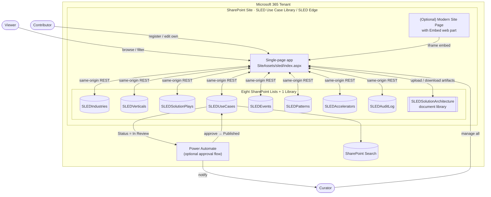
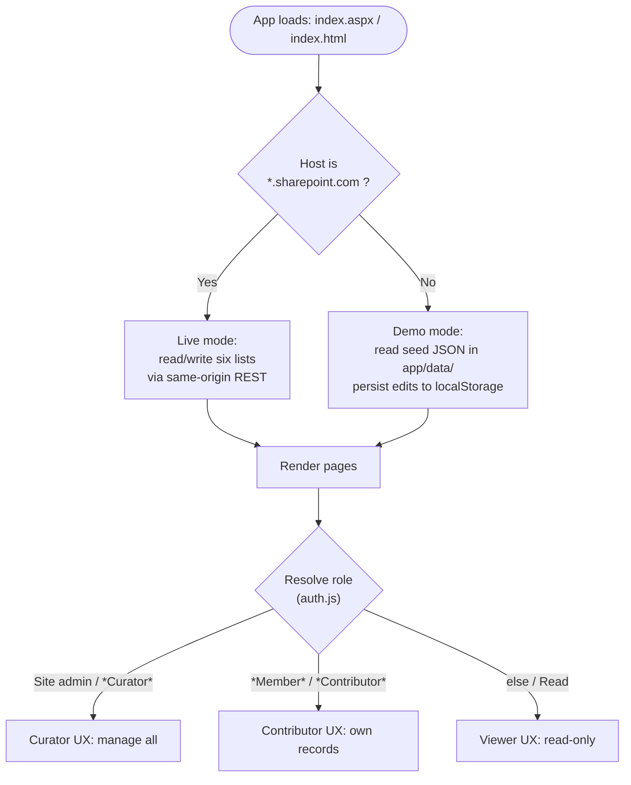
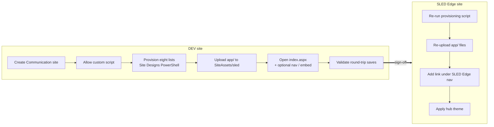

# SLED Use Case Library (SLEDEdge)

An internal Microsoft catalog of **reusable use cases** across the SLED
industries — **State & Local Government, Public Safety & Justice, Public Health &
Social Services, Transportation & Urban Infrastructure, and Education** — each
broken down into its own **verticals**. It lets Microsoft teams **contribute**
use cases, **browse** them by industry / vertical / solution play / keyword, and
**reuse** proven scenarios — surfaced through a SharePoint Online page inside the
**SLED Edge** GTM hub.

Delivered entirely on **Microsoft 365 no-code / low-code**: eight SharePoint
**Lists** (data) + a zero-build, single-page app (`index.aspx`) that browses,
registers and edits every entity over same-origin REST, with a **built-in
approval workflow** (contributor submissions wait for owner/approver sign-off)
and an optional Power Automate flow.

> **No build step, no SPFx, no app registration.** The app is plain ES modules.
> On `*.sharepoint.com` it reads/writes the live lists; anywhere else
> (localhost / `file://`) it falls back to bundled seed JSON. The only
> host-aware code lives in [`app/js/spconfig.js`](app/js/spconfig.js).

> **This README is self-contained** — the architecture diagrams, full deployment
> steps, and the modern-page embedding guide are all inline below. The `docs/`
> files hold the same content if you prefer them standalone.

---

## Table of contents

1. [Features](#features)
2. [The SharePoint lists](#the-sharepoint-lists)
3. [Repository layout](#repository-layout)
4. [Run locally](#run-locally)
5. [Architecture & flow diagrams](#architecture--flow-diagrams)
6. [Deploy to SharePoint (step by step)](#deploy-to-sharepoint-step-by-step)
7. [Embed in a modern SharePoint page (optional)](#embed-in-a-modern-sharepoint-page-optional)
8. [More docs](#more-docs)
9. [Notes](#notes)

---

## Features

- **Home** — KPIs / coverage across the SLED industries.
- **Use Cases** — browse with a horizontal filter bar (Industry, Vertical,
  Solution Play, Status, Tags, Search) + detail tabs (Overview, Solution & Tech,
  Value & Impact, Owner & Artifacts).
- **Industries** — the SLED industries, each with its own child **Verticals**.
- **Solution Plays** — a data-driven, registrable list of Microsoft solution
  plays used by use cases and patterns (no longer hardcoded).
- **Events** — a standalone events catalog.
- **Patterns / Solution accelerators** — reusable assets, templates and repos.
- **Approvals** — an Owner/Approver review queue: content submitted by
  contributors is held **Pending** until approved (or rejected with a reason).
- **Audit** — soft archive / restore with a chronological change log.
- **Register hub** — guided multi-step forms for every entity that write back to
  the lists over REST.
- **Role-aware UI + approval workflow** — Viewer / Contributor / Curator,
  resolved from SharePoint group membership and list permissions
  ([`app/js/auth.js`](app/js/auth.js)). Contributor create/edit is queued for
  approval; Curators approve and manage the taxonomy.

## The SharePoint lists

| List | Holds |
|---|---|
| `SLEDIndustries` | The SLED industries |
| `SLEDVerticals` | Verticals, each linked to a parent industry |
| `SLEDSolutionPlays` | Data-driven Microsoft solution plays |
| `SLEDUseCases` | The use case system of record (links to an industry + vertical) |
| `SLEDEvents` | Standalone events |
| `SLEDPatterns` | Reusable patterns |
| `SLEDAccelerators` | Solution accelerators / templates |
| `SLEDAuditLog` | Change / archive log |

Plus a `SLEDSolutionArchitecture` document library for per-record artifacts.

Industries, Verticals, Solution Plays, Use Cases, Patterns and Accelerators each
carry **approval columns** (`ApprovalStatus`, `SubmittedByName`, …) so
contributor submissions can be held for owner/approver review.

---

## Repository layout

```
SLEDEdge/
  README.md                          this file
  PHASE-1-PLAN-AND-ARCHITECTURE.md   design baseline
  PHASE-2-PROTOTYPE-RUNBOOK.md       detailed GUI stand-up steps
  CHECKPOINT.md                      crash-recovery handoff / status
  docs/
    FLOW-DIAGRAM.md                  architecture & data-flow diagrams
    SHAREPOINT-DEPLOYMENT.md         step-by-step deployment guide
    EMBED-IN-MODERN-PAGES.md         optional modern-page embedding
  lists/
    sled-list-schema.json            canonical column definitions (all lists)
    provision-sled-via-sitedesign.ps1  PowerShell Site Designs provisioner (no PnP)
    provision-sled-list-browser.js   browser-console provisioner (no PnP)
    seed-sled-data-browser.js        browser-console demo-data seeder
    clear-sled-data-browser.js       browser-console data reset (clears all SLED* lists)
  app/
    index.aspx                       SharePoint host page (renders on SPO)
    index.html                       local-preview host page
    css/styles.css                   design system
    js/                              constants, spconfig, factory, store,
                                     data, docs, auth, app (ES modules)
    data/                            seed JSON (local preview ONLY — do not deploy)
    serve.ps1                        local preview server
```

---

## Run locally

Requires **PowerShell 7** (`pwsh`).

```powershell
cd ./app
pwsh ./serve.ps1 -Port 8087
# open http://localhost:8087/index.html
```

You'll see the full app reading the seed JSON in [`app/data/`](app/data/); edits
persist to `localStorage` in demo mode. Preview each role by appending
`?role=viewer|contributor|curator` to the URL. Use `index.html` locally —
`index.aspx` only renders on SharePoint.

## Architecture & flow diagrams

All diagrams are [Mermaid](https://mermaid.js.org/) and render natively on
GitHub. The standalone copy lives in
[docs/FLOW-DIAGRAM.md](docs/FLOW-DIAGRAM.md).

### 1. Component architecture



### 2. Runtime data flow (DEV/PROD host detection)

The identical code runs in both environments. `app/js/spconfig.js` inspects the
host and chooses the data source — no code change between DEV and PROD.



### 3. Contribution & approval lifecycle

```mermaid
sequenceDiagram
    actor C as Contributor
    participant App as App (Register form)
    participant L as SLED list (Use Case / Pattern / …)
    participant Ap as Approvals tab
    actor R as Curator / Owner

    C->>App: Submit (Use Case, Pattern, Accelerator or Solution Play)
    App->>L: Create/update item (ApprovalStatus = Pending)
    Note over L: Hidden from the public catalog while Pending
    R->>Ap: Open Approvals (Owners/Approvers only)
    alt Approve
        Ap->>L: ApprovalStatus = Approved
        Note over L: Now visible in the catalog
    else Reject
        Ap->>L: ApprovalStatus = Rejected (+ reason)
        Note over L: Stays hidden; kept for audit
    end
```

> Curator/Owner submissions publish immediately (no self-approval needed). The
> in-app Approvals queue is the primary workflow; the optional Power Automate
> flow (Step 8) can layer on Teams/email notifications.

### 4. Deployment flow (DEV → PROD)



> Internal column names are kept **identical** across DEV and PROD, so the app,
> view formatting and the approval flow port with only the site/list URL
> changing.

---

## Deploy to SharePoint (step by step)

The only scripted step is list provisioning (via SharePoint **Site Designs** in
the SharePoint Online Management Shell — **no PnP, no app registration, no admin
consent, no F12 browser console**). Everything else is done in the browser. The
standalone copy with extra detail lives in
[docs/SHAREPOINT-DEPLOYMENT.md](docs/SHAREPOINT-DEPLOYMENT.md).

> Replace `https://<tenant>.sharepoint.com` and the site name throughout with
> your own. This guide uses a site named `SLEDUseCaseLibrary` as the example.

### Prerequisites

| Requirement | Notes |
|---|---|
| **SharePoint / tenant admin** | Needed to create the site and allow custom script |
| **PowerShell 7** (`pwsh`) | For the local preview server (optional) |
| **SharePoint Online Management Shell** | For list provisioning — install once (below) |
| The `SLEDEdge` repo cloned locally | You'll upload files from [`app/`](app/) |

```powershell
# Install the management shell once (no PnP):
Install-Module Microsoft.Online.SharePoint.PowerShell -Scope CurrentUser -Force
```

### Step 1 — Create the site

**SharePoint admin center → `https://<tenant>-admin.sharepoint.com`**

1. **Sites → Active sites → + Create**.
2. Choose **Communication site** (cleaner navigation for a catalog).
3. **Site name:** `SLEDUseCaseLibrary` → confirm the URL becomes
   `https://<tenant>.sharepoint.com/sites/SLEDUseCaseLibrary`.
4. Set **Language**, **Time zone**, and **Owner** (you). **Finish**.

> **PROD (SLED Edge):** skip this — use the existing SLED Edge site.

### Step 2 — Allow custom script (one-time)

The app page (`index.aspx` with inline `<script>` references) requires custom
script to be **allowed** on the site.

**Admin center → Sites → Active sites → your site → Settings.**

1. Find **Custom scripts** → set **Allow users to run custom script on this
   site** to **Allow**. Save (can take a few minutes).

> PowerShell equivalent: `Set-SPOSite -Identity <siteUrl> -DenyAddAndCustomizePages 0`.

### Step 3 — Provision the lists

Creates the eight `SLED*` lists (plain Text/Note columns — booleans stored as
`Yes`/`No`, multi-values as `; `-joined text) plus the `SLEDSolutionArchitecture`
library. Each column has an explicit Field XML internal name so REST round-trips
never hit a "field does not exist" error. The script is idempotent — re-run it
after pulling updates to add any new lists/columns (e.g. Verticals, Solution
Plays, approval columns).

```powershell
cd ./lists
pwsh -File ./provision-sled-via-sitedesign.ps1 `
     -SiteUrl "https://<tenant>.sharepoint.com/sites/SLEDUseCaseLibrary"
```

- You'll be prompted to sign in as a SharePoint/tenant admin; the admin URL is
  auto-derived from the site URL.
- Communication site is assumed (`-WebTemplate 68`); add `-WebTemplate 64` for a
  Team site.
- **Idempotent** — re-running only adds missing columns. Columns apply in chunks
  of 12; large lists apply in 2–3 parts.
- If your tenant blocks doc-library creation via Site Design, re-run with
  `-SkipLibrary` and create `SLEDSolutionArchitecture` by hand.

Expected tail: `Lists OK: 8 | failed: 0` → `Done.`

**Verify:** **Site contents** shows the eight `SLED*` lists — `SLEDIndustries`,
`SLEDVerticals`, `SLEDSolutionPlays`, `SLEDUseCases`, `SLEDEvents`,
`SLEDPatterns`, `SLEDAccelerators`, `SLEDAuditLog` — plus the
`SLEDSolutionArchitecture` library. Column *internal* names are **unprefixed**
(e.g. `IndustryId`, `VerticalId`, `BusinessProblem`) — the app addresses them by
those exact names.

> Runs in **Windows PowerShell 5.1** or **PowerShell 7** — the script imports the
> SPO module the right way for whichever you use.

> **Alternative (no admin shell):** paste
> [`lists/provision-sled-list-browser.js`](lists/provision-sled-list-browser.js)
> into the browser console while signed in. Same result, also idempotent. The
> authoritative schema is
> [`lists/sled-list-schema.json`](lists/sled-list-schema.json).

### Step 4 — Set up permissions & roles

Security is enforced by SharePoint (the app reads/writes as the signed-in user,
so a disallowed write fails with 403). The app mirrors the user's role in the UI.

| Role | SharePoint group (permission level) | Can do |
|---|---|---|
| **Viewer** | Visitors (**Read**) | Browse everything; download artifacts |
| **Contributor** | Members (**Contribute** or **Edit**) | Create Use Cases, Patterns, Accelerators and Solution Plays (all **queued for approval**); edit their own |
| **Curator / Owner** | Owners (**Full Control**) | Everything: edit/archive any record, manage Industries / Verticals / Events, and **approve or reject** submissions |

1. Site → **Settings ⚙ → Site permissions → Advanced permissions settings**.
2. Use the site's default **Owners / Members / Visitors** groups (or create groups
   whose names contain *Owner*, *Member/Contributor*, or *Visitor*).
3. Add people to each group. **Group membership decides the role** — anyone in an
   *Owners*/*Curator* group (or a Site Collection Admin) is a Curator/Approver;
   *Members* are Contributors; *Visitors* are read-only. Lists and the library
   inherit site permissions — no per-list changes required.

### Step 5 — Deploy the app files

**Site contents → Site Assets.**

1. Create a folder named **`sled`** inside **Site Assets**.
2. Upload the contents of the local [`app/`](app/) folder, preserving structure:

   ```
   SiteAssets/sled/
     index.aspx
     css/styles.css
     js/constants.js  js/spconfig.js  js/factory.js  js/store.js
     js/data.js       js/docs.js      js/auth.js      js/app.js
   ```
3. **Do not** upload `app/data/`, `index.html`, or `serve.ps1` — those are for
   local preview only. On SharePoint the app auto-switches to **live list** mode.

Open the app:
`https://<tenant>.sharepoint.com/sites/SLEDUseCaseLibrary/SiteAssets/sled/index.aspx`

- If pages are empty or a save fails, re-check the list names (Step 3); if
  scripts don't run, re-check custom script (Step 2).

### Step 6 — Surface the app in navigation

- **Option A — link directly:** Site → **Edit** navigation → **+ Add link** →
  Address `…/SiteAssets/sled/index.aspx`, Display name `Use Case Library`.
- **Option B — embed in a modern page:** see
  [the next section](#embed-in-a-modern-sharepoint-page-optional).

### Step 7 — Seed & validate

1. **(Optional) Seed demo data:** open any page on the site → **F12 → Console** →
   paste [`lists/seed-sled-data-browser.js`](lists/seed-sled-data-browser.js). It
   creates a consistent set of Industries, Verticals, Solution Plays, Use Cases,
   Patterns and Accelerators (idempotent). To wipe and start over, run
   [`lists/clear-sled-data-browser.js`](lists/clear-sled-data-browser.js) first.
2. **Register:** **+ Register → Register a Use Case** → pick an Industry, then a
   **Vertical** and **Solution Play** → **Create use case**; confirm it
   round-trips to `SLEDUseCases`.
3. **Browse/filter:** try the Industry / Vertical / Status filters and search.
4. **Solution Plays / Industries / Events / Patterns:** confirm each lists its
   records; add a Solution Play and see it appear in the use-case dropdown.
5. **Approvals:** as a Contributor (a *Member*), register a use case — it's held
   **Pending**; as a Curator/Owner, open the **Approvals** tab → **Approve** (it
   appears in the catalog) or **Reject** (with a reason).
6. **Audit:** archive a record, confirm it appears under **Audit**, then restore.

### Step 8 — (Optional) Approval flow in Power Automate

Item with **Status = In Review** → curator approval → **Published** (approve) or
**Draft** (reject) → notify.

**List → Integrate → Power Automate → Create a flow → Start from blank.**

1. **Trigger:** *When an item is created or modified* → your site, List =
   `SLEDUseCases`.
2. **Trigger condition** (prevents loops):
   `@equals(triggerOutputs()?['body/UCStatus'], 'In Review')`
3. **Start and wait for an approval** — *Approve/Reject – First to respond*;
   assign to your curator group; include Title, `IndustryId`, `BusinessProblem`,
   `OwnerName`, and the item link.
4. **Condition on Outcome:** Approved → `UCStatus` = **Published**; Rejected →
   `UCStatus` = **Draft** + email the owner with comments.

### Step 9 — DEV → PROD (SLED Edge)

Keep internal names **identical** so everything ports:

| Artifact | Method |
|---|---|
| Eight lists + columns | Re-run the provisioning script against the SLED Edge site |
| App files | Re-upload [`app/`](app/) to `SiteAssets/sled` (no code changes) |
| Approval flow | Recreate/repoint to the PROD `SLEDUseCases` list (connection change only) |
| Content | Re-register curated items in the app, or copy items between lists |
| Navigation + theme | Add link under SLED Edge nav; apply the hub theme |

### Troubleshooting

| Symptom | Fix |
|---|---|
| `index.aspx` downloads instead of rendering | Use `index.aspx` (not `.html`) and allow custom script (Step 2) |
| Pages load but are empty | List names/columns wrong — re-verify Step 3 (internal names unprefixed) |
| Saves fail with 403 | Signed-in user lacks Contribute/Edit — check group membership (Step 4) |
| App shows demo data on SharePoint | You uploaded the `data/` folder or opened it off a non-`sharepoint.com` host |
| Scripts don't run at all | Custom script not yet applied — wait a few minutes after Step 2, then hard-reload |

---

## Embed in a modern SharePoint page (optional)

The app runs perfectly standalone at `…/SiteAssets/sled/index.aspx`, but you can
also surface it **inside a modern SharePoint Site Page** so it inherits the
site's suite bar, search and theme — useful when integrating into **SLED Edge**.
Both doorways use the **same lists and data**; only the chrome differs. The
standalone copy lives in [docs/EMBED-IN-MODERN-PAGES.md](docs/EMBED-IN-MODERN-PAGES.md).

| Doorway | URL shape | Chrome |
|---|---|---|
| **Standalone** | `…/SiteAssets/sled/index.aspx` | Full-width, no site chrome |
| **Embedded** | `…/SitePages/Use-Case-Library.aspx` | Suite bar + search + site theme |

### Method — Embed web part (iframe)

Because the app lives on the **same site**, the modern **Embed** web part can
iframe it without any allow-listing.

1. On the site: **+ New → Page → Blank**. Name it e.g. `SLED Use Case Library`.
2. Add a **full-width** section, then the **Embed** web part.
3. Paste the app URL, or the full `<iframe>` form:
   ```html
   <iframe src="https://<tenant>.sharepoint.com/sites/SLEDUseCaseLibrary/SiteAssets/sled/index.aspx"
           width="100%" height="1600" style="border:0;"></iframe>
   ```
4. **Publish** the page and add it to navigation.

> **Same-site only.** If you ever host the app on a *different* site collection,
> add that origin under **SharePoint admin center → Advanced → HTML field
> security** for the target site.

### Recommended page settings

| Setting | Where | Why |
|---|---|---|
| **Header layout: Minimal** | Page → Edit → header settings | Reclaims vertical space |
| **Section: Full-width** | Add-section chooser | App fills the width |
| **Site navigation: off** *(optional)* | Change the look → Navigation | Avoids double navigation |
| **Fixed iframe height (~1400–1800px)** | Embed web part | SPA — a generous height avoids inner scrollbars |

### Tips & gotchas

- **Use `index.aspx`, not `index.html`** — a raw `.html` in a library tends to
  *download* rather than render.
- **Iframe height is fixed** — modern Embed doesn't auto-resize; prefer the
  standalone doorway for the richest pages (long Use Case detail views).
- **Theme** — the embedded page inherits the site/hub theme automatically; the
  app keeps its own design system inside the iframe.

**Which doorway?** Standalone for day-to-day use and the richest pages; embedded
for integration into SLED Edge with the suite bar / search / theme around it. You
can ship **both** — they read and write the same six lists.

---

## More docs

The following hold the same material as above (standalone) plus deeper design and
runbook detail:

| Doc | What it covers |
|---|---|
| [docs/FLOW-DIAGRAM.md](docs/FLOW-DIAGRAM.md) | Architecture & data-flow diagrams (Mermaid) |
| [docs/SHAREPOINT-DEPLOYMENT.md](docs/SHAREPOINT-DEPLOYMENT.md) | Step-by-step SharePoint Online deployment |
| [docs/EMBED-IN-MODERN-PAGES.md](docs/EMBED-IN-MODERN-PAGES.md) | *(Optional)* Embedding the app in a modern page |
| [PHASE-1-PLAN-AND-ARCHITECTURE.md](PHASE-1-PLAN-AND-ARCHITECTURE.md) | Full architecture, data model & governance plan |
| [PHASE-2-PROTOTYPE-RUNBOOK.md](PHASE-2-PROTOTYPE-RUNBOOK.md) | Detailed GUI-first prototype stand-up runbook |

---

## Notes

- This is an **internal Microsoft** enablement tool. Replace the example tenant
  placeholders (`https://<tenant>.sharepoint.com/...`) with your own site URL.
- No secrets or credentials are stored in this repository. The app authenticates
  as the signed-in SharePoint user; SharePoint is the real security gate.
