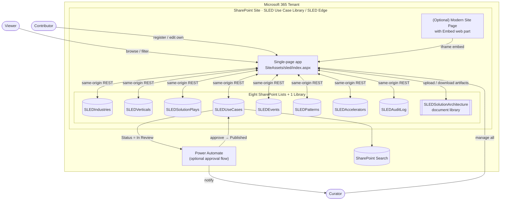
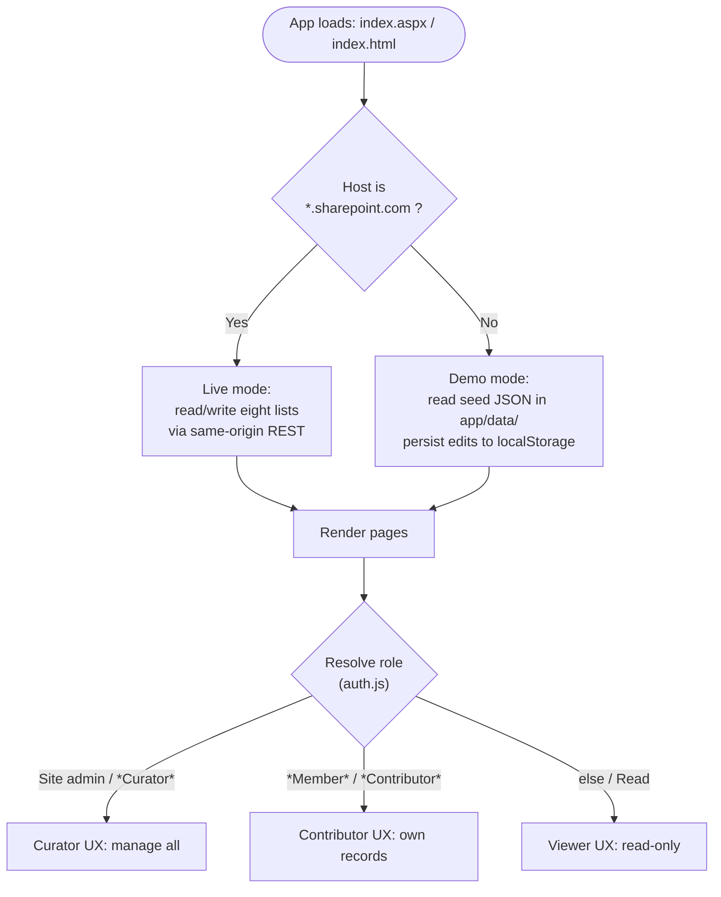
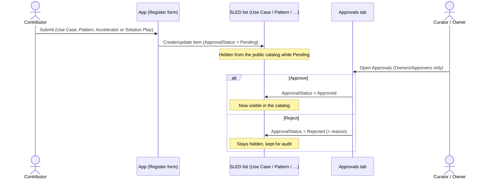
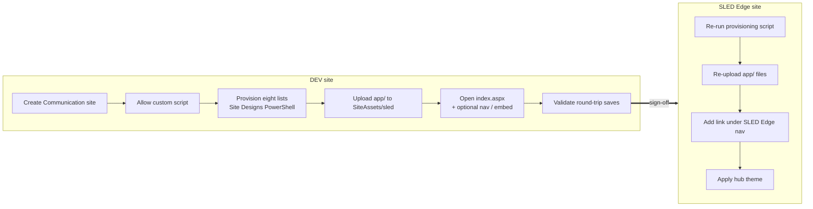

# SLED Use Case Library — Flow & Architecture Diagrams

This document captures the solution as a set of diagrams: the component
architecture, the runtime data flow, the contribution / approval lifecycle, the
DEV → PROD deployment flow, and the DEV/PROD host auto-detection logic.

All diagrams are [Mermaid](https://mermaid.js.org/) and render natively on
GitHub.

---

## 1. Component architecture

---

## 2. Runtime data flow (DEV/PROD host detection)

The identical code runs in both environments. `app/js/spconfig.js` inspects the
host and chooses the data source — no code change between DEV and PROD.

---

## 3. Contribution & approval lifecycle

> Curator/Owner submissions publish immediately. The in-app Approvals queue is
> the primary workflow; the optional Power Automate flow can add Teams/email
> notifications.

---

## 4. Deployment flow (DEV → PROD)

> Internal column names are kept **identical** across DEV and PROD, so the app,
> view formatting and the approval flow port with only the site/list URL
> changing.
